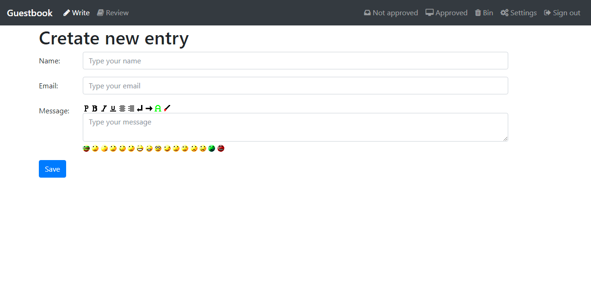
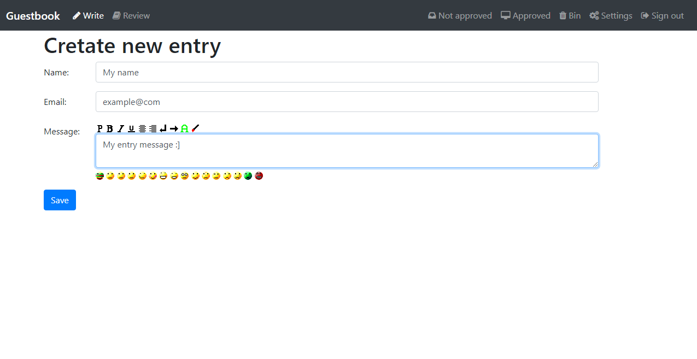
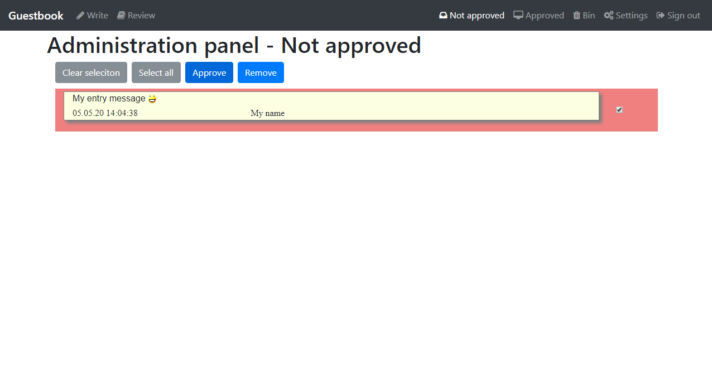
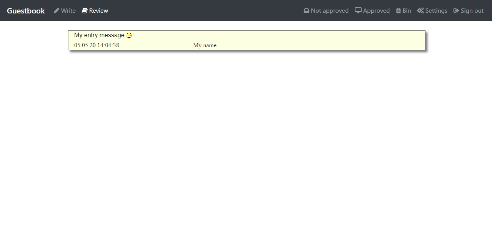

# Guestbook
Website guest book written in PHP

## License
Library is licensed under BSD 3-Clause License

## Requirements
**PHP 8.1** with **pdo_sqlite** extension.
May also works with older php versions, but since they are not supported, this is not guaranteed.

## Installation info
After unzip files on your server go to ~/admin/ and try login with 

Name: **admin**  
Password: **admin**

Then go to settings and change user name and password.

## Features
- adding new entries to considered by the admin
- approving/discarding added entries
- removing approved entires
- store removed entries in bin

## Screen captures

### Adding entry site

### Admin approving site

### Entry review site

